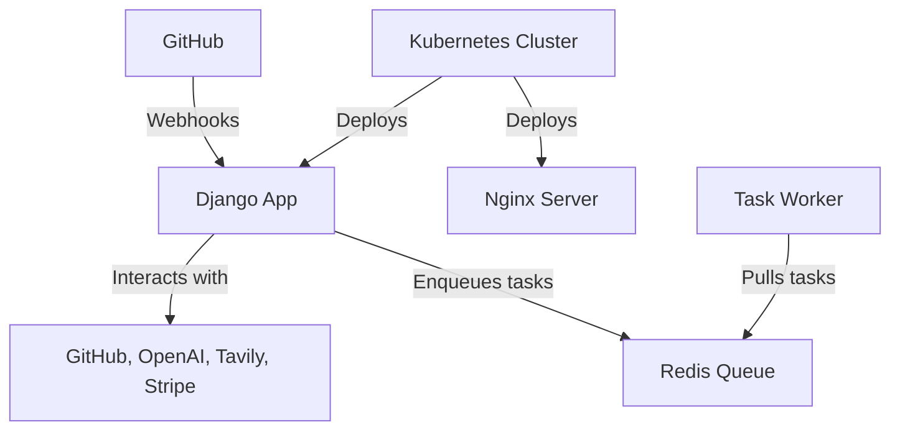

# Arcane Engine Architecture

At its core, Arcane Engine utilizes a **GitHub app** to facilitate interactions with GitHub repositories. The backbone of Arcane Engine is a **Django** application, which is deployed to handle **GitHub webhooks**. For serving static files, Arcane Engine employs an **nginx** server. To manage the deployment of the Django application, nginx server, and the execution of jobs, Arcane Engine relies on a **Kubernetes cluster**.

## Architecture Diagram

This diagram illustrates the flow of interactions within the Arcane Engine architecture, highlighting the central role of the Django application in managing webhooks and interacting with external services. Additionally, it introduces the **Redis Queue** as the mechanism for managing asynchronous tasks, with a **Task Worker** responsible for executing these tasks. 
