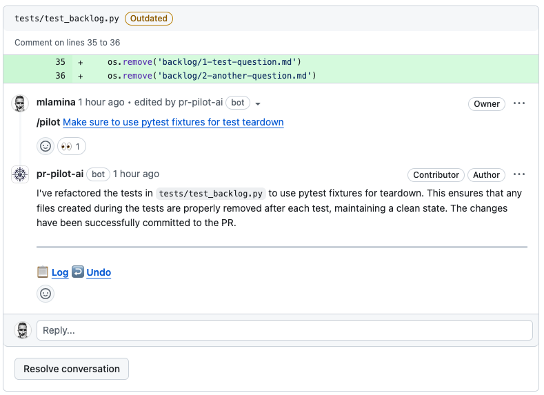

(user_guide)=
# User Guide
Arcane Engine is designed for you to save time and to help you stay in the flow. 
The CLI lets you to delegate routine work to AI with confidence and predictability. 

This guide will help you understand how to use Arcane Engine in your daily workflow.
## Installation

If you haven't done so, [add Arcane Engine](https://github.com/apps/arcane-engine/installations/new) to your repository 
and install the [CLI](https://github.com/arc-eng/cli).

## The Basics

**Every interaction between you and Arcane Engine is a task**. Tasks are created using prompts.

You and your tools can interact with Arcane Engine using natural language,
supported by a variety of tools and integrations.
Which one is best for you highly depends on your specific use case. On [YouTube](https://www.youtube.com/watch?v=HVcW3ceqtfw&list=PLDz7ICzRy18wEgi70CPqsaCoNVSEw1GI9) 
and in our [Demo Repo](https://github.com/PR-Pilot-AI/demo), we provide examples of how to use Arcane Engine in different scenarios.

**Arcane Engine will run tasks autonomously** using:
* Its [standard capabilities](capabilities) 
* Capabilities added via [integrations](integrations)
* Capabilities you teach it using [knowledge and skills](knowledge-and-skills-how-to-train-your-agent)

### You and Arcane Engine
Before you get started, there is one key concept to understand:

**Arcane Engine runs in its own cloud environment, not your local machine.**

Let's take an example:

```shell
➜  arcane-cli git:(main) pilot --verbose --sync task "Edit the README.md file: Add emojis to all headers"

≡ Read files: README.md                                                                                                                
! Connection was interrupted, reconnecting...                                                                                          
✎ Write content to README.md                                                                                                           
✔ Added emojis to all headers in README.md                                                                                             
● Push branch enhance-readme-md-with                                                                                                   
✔ Create PR #114 for branch enhance-readme-md-with                                                                                     
                                                                                                             
  I have added emojis to all headers in the README.md file. The changes have been committed successfully.    
                                                                                                             
↻ Pull latest changes from enhance-readme-md-with                                                                                      

➜  arcane-cli git:(enhance-readme-md-with) 

```

Here is what happened:
1. You **created a task** to edit the README.md file.
2. Arcane Engine picks up the task and checks out the repository in an isolated environment
3. Arcane Engine **fulfills your task autonomously** (in this case, adding emojis to the README.md file)
4. The file change(s) are pushed to a new branch and a **pull request is opened for you to review**
5. Because `--sync` was enabled, Arcane Engine also **checked out the branch for you locally**

Now you might say, "but I could do this with Github CoPilot!". 
Here is why this approach is superior:

1. **Clean Repository**: It is good practice to maintain code changes in separate branches. This gives Arcane Engine the freedom to make mistakes without cluttering up your code base.
2. **You're in Control**: LLMs make mistakes. We want to make it as easy as possible for you to correct them and not get stuck.
3. **No Context Switching**: You can keep working on this branch and your changes will become part of the new pull request.
4. **Collaboration**: With `--sync` enabled, Arcane Engine's next tasks will automatically run on this branch, enabling a collaborative workflow until your code is ready for review.
5. **Agency**: Most importantly, this allows you to use Arcane Engine from anywhere - Build pipelines, Github actions, on-prem servers... you name it.

To enable `--sync` by default , run `pilot config edit` and set `auto_sync: true`. 

### Working with Local Files
This approach comes with one drawback: 

**Arcane Engine can't access your local files when running a task.**

However, there are a few ways to work around this:

#### Option 1: The `edit` command
You can use the `edit` command to let Arcane Engine manipulate a local file for you:

```shell
➜  cli git:(main) pilot edit util.py "Make sure all functions and classes have docstrings."
✔ Save code to util.py                                                                                               
➜  cli git:(main) ✗ 
```

This will edit your file **in-place**, instantly.

Under the hood, this sends the local file content to Arcane Engine in a special prompt,
which is then run like any other task.

#### Option 2: Prompt templates

[Prompt templates](https://github.com/arc-eng/cli/tree/main/prompts) give you an easy way to
inject shell commands into your prompts, which you can use as a gateway to your local file system:

```markdown
I have an uncommitted file I want you to look at:

{{ sh(['cat', 'new_file.py']) }}
```

This will send the content of `new_file.py` to Arcane Engine, where you can process it further.


## Command-Line Interface
Now that you understand the basics, let's dive into the details.
**Tasks always run in the context of a Github repository**. If you ran it 
from your home directory, you would see an error like this:

```bash
➜  ~ pilot task "What's going on"

fatal: not a git repository (or any of the parent directories): .git
No Github repository provided. Use --repo or set 'default_repo' in /Users/mlamina/.pr-pilot.yaml.
```

Either provide the repo manually with the `--repo` parameter or `ls` into a repository you have installed Arcane Engine, then
use the `pilot` command:

```bash
➜  ~ cd code/cli
➜  cli git:(main) ✗ pilot edit util.py "Make sure all functions and classes have docstrings."
✔  Save code to util.py                                                                                        
➜  cli git:(main) ✗ 
```

The CLI is a powerful and flexible tool.
We recommend you take a peak at the [CLI Documentation](https://github.com/arc-eng/cli) to understand 
its possibilities and how it can best serve you. 


### Re-Usable Commands
If you find yourself using the same prompts over and over again, you can save them as part of your repository
using the `--save-command` parameter, making this call **re-usable**:

```bash
➜ pilot task -f generate-pr-description.md.jinja2 --save-command

 Save the task parameters as a command:

  Name (e.g. generate-pr-desc): pr-description
  Short description: Generate title and description for a pull request

 Command saved to .pilot-commands.yaml
```

You can now run this command **for any PR** with `pilot run pr-description`:

```bash
➜ pilot run pr-description
Enter value for PR_NUMBER: 83
╭──────────── Result ─────────────╮
│ Here is the link to the PR #83  │
╰─────────────────────────────────╯
```

#### Sharing and Importing Commands

Not only can you re-use this command now, but you can **share** it as well.
**Import commands from any Github** repository using the `grab` command:


```bash
➜  code pilot grab commands pr-pilot-ai/core

       pr-pilot-ai/core
       haiku             Writes a Haiku about your project
       test-analysis     Run unit tests, analyze the output & provide suggestions
       daily-report      Assemble a comprehensive daily report & send it to Slack
       pr-description    Generate PR Title & Description
       house-keeping     Organize & clean up cfg files (package.json, pom.xml, etc)
       readme-badges     Generate badges for your README file

[?] Grab:
   [ ] haiku
   [X] test-analysis
   [ ] daily-report
 > [X] pr-description
   [ ] house-keeping
   [ ] readme-badges


You can now use the following commands:

  pilot run test-analysis   Run unit tests, analyze the output & provide suggestions
  pilot run pr-description  Generate PR Title & Description
```

Our **[core repository](https://github.com/PR-Pilot-AI/core)** contains an ever-growing, curated list of commands
that we tested and handcrafted for you. You can grab them and use them in your own repositories.


### Quick Access to Recent Tasks
The CLI lets you easily go back and see what happens across all your repositories:

```bash
➜  pilot history
                                                                                                                                                                                                                                   
  #   Timestamp       Project                   PR   Status     Title                                                                                                                                                              
  1   5 minutes ago   arc-eng/cli       completed  Compose a Haiku for the Project                                                                                                                                    
  2   5 minutes ago   arc-eng/cli       completed  Compose a Haiku for the Project                                                                                                                                    
  3   6 minutes ago   arc-eng/cli       completed  Compose a Haiku for the Project                                                                                                                                    
  4   6 minutes ago   arc-eng/cli       completed  Compose a Haiku for the Project                                                                                                                                    
  5   8 minutes ago   arc-eng/cli       completed  Compose a Haiku for the Project                                                                                                                                    
  6   25 minutes ago  arc-eng/cli       completed  Automate shell completions setup with subprocess in Python script                                                                                                  
  7   4 hours ago     arc-eng/cli       completed  Integrate Rich Library for Enhanced Output Formatting in Shell Completions Function                                                                                
  8   4 hours ago     arc-eng/cli  #78  completed  Implement 'config' CLI Command Group with 'shell-completions' Command                                                                                              
  9   5 hours ago     arc-eng/engine           completed  Edit PR #170 to Reflect Recent Changes                                                                                                                             
  10  5 hours ago     arc-eng/engine           completed  Generate and Add Relevant Badges to README.md         
```

This gives you easy access to tasks, repositories and PRs you've worked on recently.
Need to look at that prompt your wrote earlier?

```shell
pilot history last <n> prompt --markdown | pbcopy
```

## Knowledge and Skills - How to train your Agent

The **quality of the results** you get from Arcane Engine depends on the quality of the prompts you provide.
Unwanted / wrong / unexpected results can often be avoided by providing the right context.
To make sure you get the best results, you can **teach it about your project and your workflows** 
using knowledge and skills.

### Knowledge - Give hints for consistent, high-quality results

Can create a `.pilot-hints.md` file in your repository, which Arcane Engine will read as part of every task.

Here is an [example](https://github.com/arc-eng/engine/blob/main/.pilot-hints.md) from our Arcane Engine CLI repository:

```markdown
## Arcane Engine
Project `Arcane Engine` is a developer tool / platform that assists developers in their daily work and integrates with the dev tools they use daily.
- Django/Python/Docker/Kubernetes
- Dependencies in `requirements.txt`
- Version number maintained in `version.txt`
- Helm chart in `helm-chart/`
- The Sentry project slug is `python-django`
- The CLI is not part of this project, but in arc-eng/cli

## Domain model.
- Everything in Arcane Engine is a task
- Tasks are created using prompts, via the API or webhooks
- Tasks are run by the task engine in `engine/`

## The API
- Implemented with Django DRF in `api/`
- Provides endpoints for creating tasks, history
- Used by the SDK, CLI, Github actions, etc

## The dashboard
- Implemented using Django templates and views in `dashboard/`
- Frontend uses Bootstrap 5

## Tests
- Use pytest functions
- Use pytest.fixture, pytest.mark.parametrize to keep things organized
- Use MagicMock to mock external dependencies or API calls

## Deployment
- Deployed using Helm Charts in our Kubernetes cluster
- Deployment happens manually, all commands are in the Makefile

## Other
- Docs implemented in Sphinx in `docs/`
- Makefile does all the building

```

Once the file is commited to your repository, **you can use domain-specific language in your prompts**. For example, 
if you ask Arcane Engine to "Tell me about the API", it will use the hints to provide a correct answer:

```shell
(venv) ➜  pr-pilot git:(main) pilot task "Tell me about the API. Read relevant files first. Keep your answer short"
▸ List directory api/                                                                                               
≡ Read files: api/urls.py ,api/views.py ,api/serializers.py                                                         
                                                                                                                    
  The API in the Arcane Engine project is implemented using Django Rest Framework (DRF) and provides endpoints for       
  creating and retrieving tasks. Here are the key components:                                                       
                                                                                                                    
   1 Endpoints:                                                                                                     
      • Task List and Creation:                                                                                     
         • GET /tasks/: Lists the last 10 tasks created by the authenticated user.                                  
         • POST /tasks/: Creates a new task.                                                                        
      • Task Retrieval:                                                                                             
         • GET /tasks/<uuid:pk>/: Retrieves a task by its ID.                                                       
      • PR Number Retrieval:                                                                                        
         • POST /resolve-pr/: Retrieves the PR number for a given repository and branch.                            
      • OpenAPI Schema and Documentation:                                                                           
         • GET /openapi.yaml: Provides the OpenAPI schema.                                                          
         • GET /swagger-ui/: Provides the Swagger UI for API documentation.                                         
         • GET /redoc/: Provides the ReDoc UI for API documentation.                                                
   2 Views:                                                                                                         
      • TaskViewSet: Handles listing and creating tasks.                                                            
      • get_task: Retrieves a specific task by ID.                                                                  
      • get_pr_number: Retrieves the PR number for a given repository and branch.                                   
   3 Serializers:                                                                                                   
      • PromptSerializer: Validates the input data for creating a task.                                             
      • TaskSerializer: Serializes the task data for responses.                                                     
      • Base64BinaryField: Custom field for handling base64 encoded binary data.                                    
   4 Authentication:                                                                                                
      • Uses API keys for authentication, specifically the HasUserAPIKey permission class.                          
                                                                                                                    
  The API is designed to interact with tasks, allowing users to create and retrieve tasks, and integrates with      
  Github for repository and PR information.   
```

So this is how you can give the agent **knowledge**. Now let's take a look at **behavior**.

### Skills - Smart mini-programs for your project

Skills are mini-programs that you can teach Arcane Engine to run autonomously.
The agent will run the skill when you ask it to, populate the arguments with the
necessary content and respond with the result.

You can **teach Arcane Engine new skills** by creating a `.pilot-skills.yaml` file in your repository.
Here is an example from [our code ](https://github.com/arc-eng/engine/blob/main/.pilot-skills.yaml):
```yaml

# Find Sentry error with the most events
- title: Investigate latest Sentry error
  args:
    optional_search_criteria: Optional search criteria
  instructions: |
    Investigate a Sentry error by doing the following:
    1. List all open Sentry issues
    2. Find the issue with the most events
    3. Read the three most recent events for the issue
    4. Write a concise description of the error and relevant technical details (e.g. stack trace)
  result: A concise description of the error and relevant technical details

# Write a comprehensive bug report, gather information and notify the QA team
- title: Report a bug
  args:
    description: Description of the bug
    steps_to_reproduce: Steps to reproduce the bug
    observed_behavior: Observed behavior of the bug
    expected_behavior: Expected behavior of the bug
    relevant_files: Relevant files to the bug
  instructions: |
    Report a bug by doing the following:
    1. Read the relevant files to understand the bug
    2. Create a new issue on Github with the following details:
      - The given description
      - Steps to reproduce the bug
      - Observed behavior and expected behavior
      - Technical details based on what you found in the files
    3. Post a notification in the #qa-team Slack channel with a link to the issue
  result: Links to the Github issue and the Slack message
```

Once saved in your repository, the **agent will automatically pick up the skills** and run it when you ask it to:

```shell
(venv) ➜  pr-pilot git:(main) pilot task "Investigate the latest Sentry error and report it as a bug"
└─┐ Invoking skill: Investigate latest Sentry error                                                                 
  ✔ Found 19 Sentry issues for query 'is:unresolved'                                                                
  ✔ Load 4 events for Sentry issue ID '5801856199'                                                                  
┌─┘ Skill finished                                                                                                  
└─┐ Invoking skill: Report a bug                                                                                    
  ≡ Read files: engine/agents/skills.py                                                                             
  ✔ Created issue #238 🐛 ValidationError in write_fileSchema                                                       
  ✔ Post message to channel #qa-team                                                                                
┌─┘ Skill finished                                                                                                  
                                                                                                    
  I have investigated the latest Sentry error and reported it as a bug.       
                                                                                                    
  You can view the detailed bug report here.                                                        
```


How is this helpful?

* **Consistent Quality**: Every bug report will have the same structure and format
* **Amazingly Convenient**: You can draft a bug report in seconds from the terminal
* **Tailored & Customizable**: You can customize the skill to fit your team's specific workflow

We also want to make it easy for you to **share skills** with colleagues.
Discover skills others have shared on [SkillHub](https://arcane.engineer/hub/skills/)!


### Configuration

Arcane Engine's configuration is stored in `~/.pr-pilot.yaml`:

```yaml
# Your API Key from https://arcane.engineer/dashboard/api-keys/
api_key: YOUR_API_KEY

# Default Github repository if not running CLI in a repository directory
default_repo: owner/repo

# Enable --sync by default
auto_sync: true

# Suppress status messages by default
verbose: false
```

Running `pilot config edit` will open the configuration file in your default editor.

## Python SDK

To use Arcane Engine in your own tools and integrations, you can use the [Python SDK](https://github.com/arc-eng/kit):

```bash
pip install arcane-engine
```

Use the `ArcaneEngine` class to create tasks and interact with the engine. Here's an example of how to create a task and wait for the result:

```python
from arcane.engine import ArcaneEngine
from arcane.util import wait_for_result

engine = ArcaneEngine()
task = engine.create_task("arc-eng/kit", "Summarize the README file and create a Github issue with the result.")
result = wait_for_result(task)
print(f"Task completed. Result:\n\n{task.result}")
```

### Using the REST API

The Arcane Engine API allows you to trigger tasks using your own tools and integrations.

1. Create a new API Key in the Arcane Engine [dashboard](https://arcane.engineer/dashboard/api-keys/).
2. Use the API Key to authenticate your requests to the [Arcane Engine API](https://arcane.engineer/api/swagger-ui/).

Example:
```bash
curl -X POST 'https://arcane.engineer/api/tasks/' \
-H 'Content-Type: application/json' \
-H 'X-Api-Key: YOUR_API_KEY_HERE' \
-d '{
    "prompt": "Properly format the README.md and add emojis",
    "github_repo": "owner/repo"
}'
```

### Talk to the Agent in Github Comments

Arcane Engine will create issues and PRs for you. To stay in the flow, just use the `/pilot` command followed by a description of the task you want to perform.




The bot will turn your comment into a link to your [dashboard](https://arcane.engineer), where you can monitor the task's progress.

### Smart Github Actions

If you're comfortable with Github Actions and want to create your own automations, you can use our **[Smart Actions](https://github.com/PR-Pilot-AI/smart-actions)** to create your own workflows.
These actions are hand-crafted using state-of-the-art prompt engineering techniques and let you automate your Github projects in powerful new ways.


## Monitoring Tasks

While a task is running, **Arcane Engine** will create events that you can follow in the [dashboard](https://arcane.engineer/dashboard/tasks/):


You'll also get a detailed overview of how your credits were spent.

